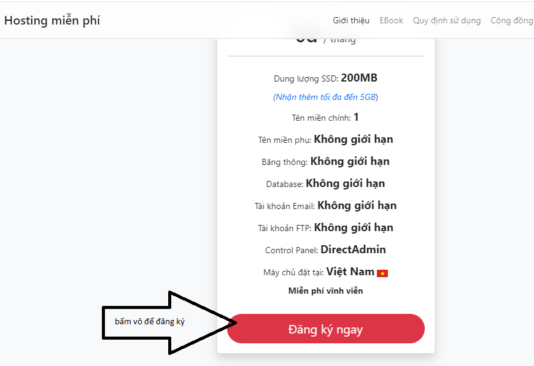
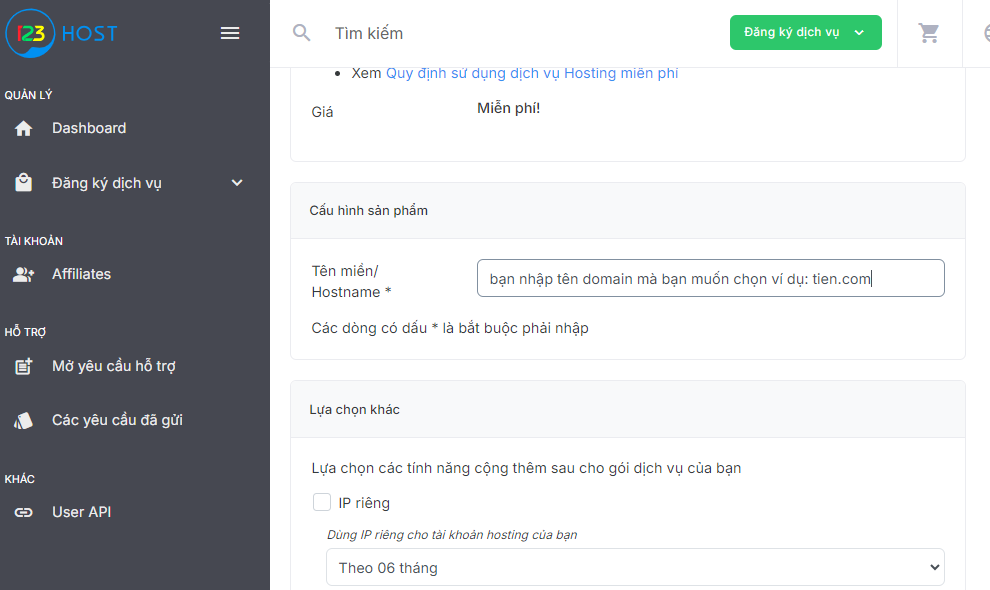
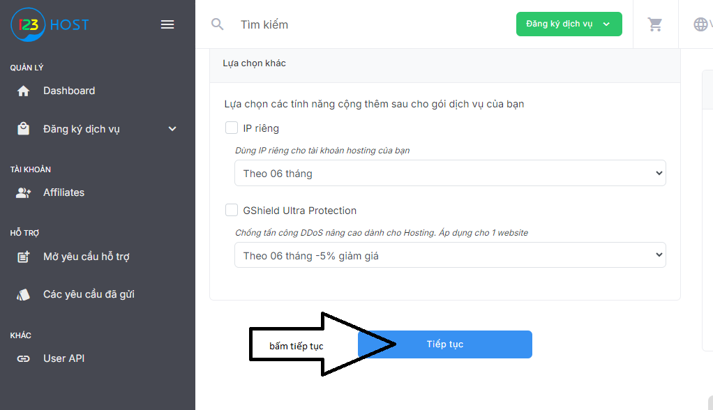
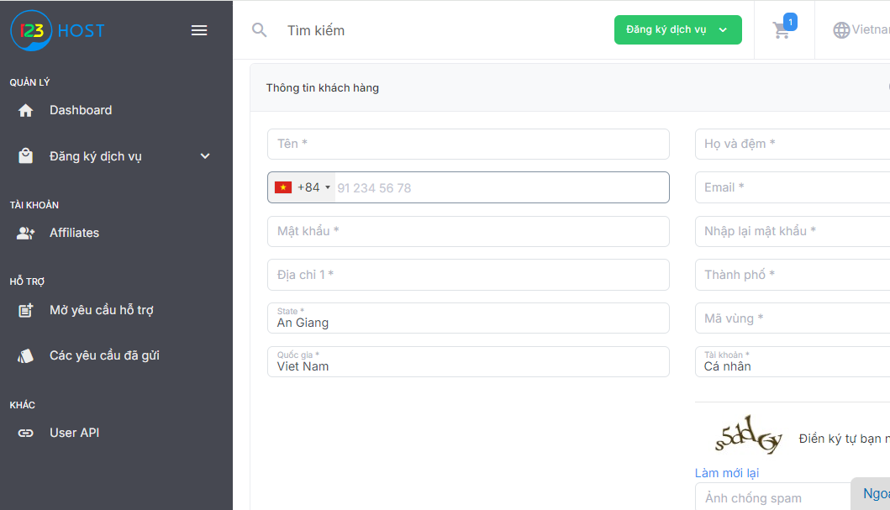
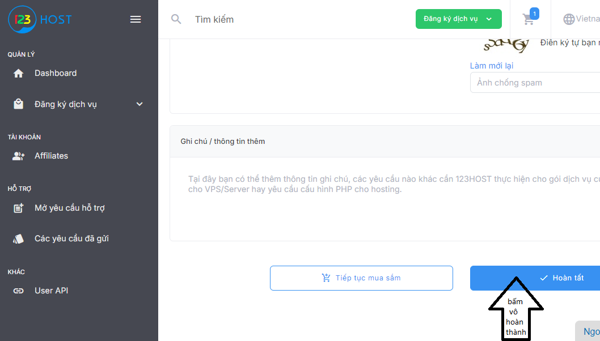
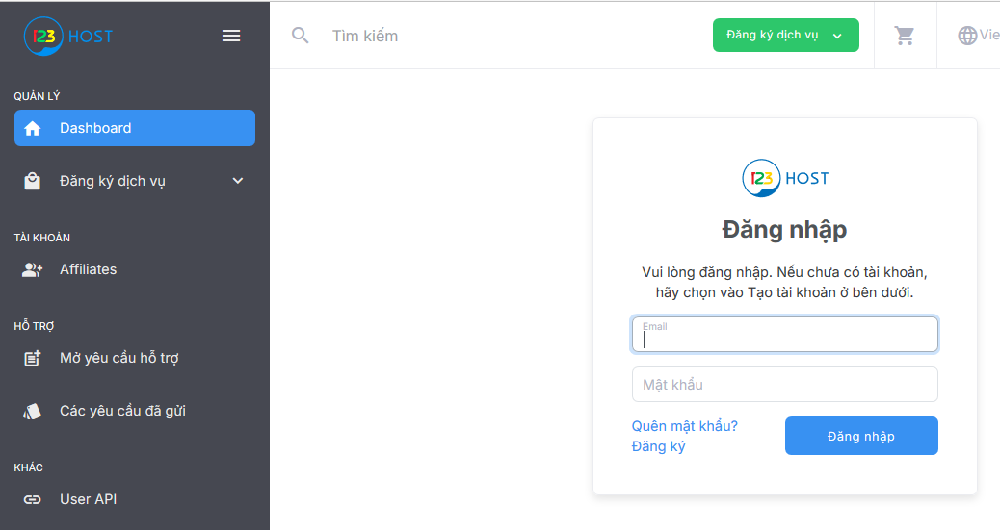

# HƯỚNG DẪN CÁCH XEM ZALTV IPTV

Những điều bạn cần biết để có thể xem link iptv được chia sẻ

- **Bước 1:** Bạn bấm nút [đăng ký](https://123host.vn/hosting-mien-phi.html?utm_source=INV&utm_medium=FHREF&utm_campaign=131954)

- **Bước 2:** Bạn bấm vào nút **đăng ký** trên web

- **Bước 3:** Bạn điền Tên miền/ Hostname * các bạn điền tên bạn không dấu ví dụ **tien.com**

- **Bước 4:** các kéo xuống bên dưới bấm vô chữ **tiếp tục**

- **Bước 5:** Điền **thông tin khách hàng** mục có *

- **Bước 6:** Sau khi điển hết thông tin kéo xuống bấm **hoàn thành**

- **Bước 7:** Sau khi các bạn đăng ký thành công sẽ có email gửi về email thông tin đăng nhập các bạn bạn [đăng nhập](https://client.123host.vn/?/clientarea/)

- **Bước 8:** Truy cập vào [Page ZalTV](https://www.facebook.com/zaltv.gq) nhắn tin tên mà bạn đã đăng ký ở trên xong chờ gửi link cho các bạn.

- **Bước 9:** Tải App Tivimate, OTT Navigator, Televizo... để nhập list được gửi từ messger.

| App            | Link apk|
|--------------------|--------------------------------------------------|
| Tivimate Pre 5x (bản gốc)    | [Download APK](https://files.tivimate.com/tivimate.apk)|
| Tivimate Crack phaptx5   | [Download APK](https://www.mediafire.com/folder/nkult5ncvdbke/Tivimate)|
| Tivimate Crack lambass   | [Download APK](https://lambassvn.github.io/TiviMate-IPTV_Premium_LamBass_2024.apk)|
| OTT Navigator 1.7.1.6   | [Download APK](https://github.com/LamBassVN/AIO-APPS/raw/master/OTT-Navigator-IPTV_1.7.1.6_Mod.apk)|
| Televizo Pre Crack lambass    | [Download APK](https://lambassvn.github.io/Televizo-IPTV_Premium_LamBass_2023.apk)|
| Televizo Pre Crack phaptx5    | [Download APK](https://www.mediafire.com/file/u2h2outpzqfojb6/Televizo_v1.9.1.5_Premium_arm7.apk/file)|

* Vì sao tôi phải đăng ký ở **bước 1**? Do Server cần máy chủ ở VN nên cần phải có thêm Lưu Lượng lưu trữ để có thể chia sẻ cho các bạn.
* Các bạn nào không muốn đăng ký thì có thể có bỏ qua bài hướng dẫn này xin cảm ơn.
  
**Chú ý**: Các bạn được chia sẻ lung tung ra bên ngoài sẽ **khóa link vĩnh viễn**.

 
